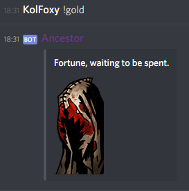
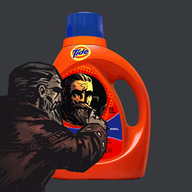

BOT WAS STOLEN, PLEASE REMOVE IT FROM YOUR SERVER RIGHT NOW
====
> Discord bot that mimics Ancestor's (from the game Darkest Dungeon) behavior and humour. Tests resolve.

Table of Contents
-----------------

1. [Public Bot Usage](#Public-Bot-Usage) 
    * [Invite URL](#Invite-URL)
    * [Top.gg Page](#Topgg-Page)
    * [Commands](#Commands)
    * [Chat Reactions](#Chat-Reactions)
    * [Command Examples](#Command-Examples)    
    * [Chat Reactions Examples](#Chat-Reactions-Examples)
1. [Running Your Own AncestorBotPHP](#Running-Your-Own-AncestorBotPHP)
    * [Requirements](#Requirements)
    * [Creating Discord Bot Application](#Creating-Discord-Bot-Application)
    * [Running the Bot in CLI](#Running-the-Bot-in-CLI)
    * [Running the Bot in Docker](#Running-the-Bot-in-Docker)    
1. [Credits](#Credits)
1. [Privacy Policy](#Privacy-Policy)

## Public Bot Usage
To use AncestorBotPHP, simply invite him to your Discord server via invite URL (provided you are the server administrator or have permission to do so).

### Invite URL

**BLANK FOR NOW**

### Top.gg Page
https://top.gg/bot/406438624473907200

-----

### Commands

Command prefix: **`!`** (exclamation mark)

Commands are called by sending a text message containing **`![command name] [arguments (if any)]`** in a chat accesable by the AncestorBot.

|Name   |Description   |Aliases   | Syntax   |
| :------------ | :------------ | :------------ | :------------ |
| help  | Lists all commands if used without arguments. Displays description of a command if used with an apropriate argument.   |   | ** `help`**, **`help [command]`**|
| fight  | Launches the Farmstead minigame. [More information and instructions.](farmstead_readme.md "More information and instructions.")  | f, df, dfight  |**`f`**, **` f [name of an action]`**, **`f pass turn`**, **`f help`**, **`f stats`**, **`f actions`**, **`f ff`**, **`f [class name]`** |
| gold  | Sends picture of a random reward.  |   | **`gold`**  |
| spin | Creates and sends a GIF of a user avatar or of a provided picture spinning inside of Tide™. If no arguments are provided, sender's own avatar is spinned.|   | **`spin`**, **`spin [user mention]`**, **`spin [picture url]`**|
| zalgo  |  Turns given text into zalgo text. Looks something ̝̺̋l̃̊̕i͈͌͡k̛͉̕e̟̩ͥ ͆̄͐ẗ̥́̓ḧ̸͝i̷͚͘s | cursed  | **`zalgo [text]`**  |
| stress  | Creates and sends an image of a user avatar or of a provided picture being stressed by a glass of wine. If no arguments are provided, sender's own avatar is stressed.  |   |  **`stress`**, **`stress [user mention]`**, **`stress [picture url]`**  |
| roll  |  Sends a random number within given numeric span. If no arguments are provided, span of [1, 6] is used. If only one argument is provided, it will be used as a maximum of a span with the minumum of 1.  |   | **`roll`**, **`roll [max]`**, **`roll [min] [max]`**   |
| read  | Sends a writing-related curio for a user to interact with. Results depend on user's reactions and may include written text, images or literally nothing. | book, heckbooks, knowledge  | **`read`**, **`read [action name]`**  |
| reveal  | Adds tentacles to a picture or to a user avatar. If no arguments are provided, sender's own avatar is used.  | tentacles  | **`reveal`**, **`reveal [user mention]`**, **`reveal [picture url]`**  |
| remind  | Reminds a user or a role about important life lesson via text message. |   | **`remind`**, **`remind [user mention]`**, **`remind [role mention]`**  |

### Chat Reactions
Chat reactions occur when a user performs a specific action in a text channel. 
Currently AncestorBotPHP has following reactions to text messages:

- **`[My resolve is tested]` ** or ** `[user mention] resolve is tested` ** or  **`...resolve is tested...`**  — tests one's resolve, with a 25% chance of a virtue. Case insensitve.
- **`[picture or URL in NSFW-named or NSFW-marked channel]`**  — 20% chance to respond with a snarky comment.

### Command Examples

| Command   | Image  |
| ------------ | ------------ |
| zalgo  |   |
|  gold |   |
|  remind |   |
| stress  |   |
|  roll |   |
|  spin |   |
|   read (initial action)|   |
|  read (subsequent action) |   |
|  reveal |   |

### Chat Reactions Examples

- **Testing resolve**

- **Responding to content or links in a NSFW channel**

## Running Your Own AncestorBotPHP
You can either run the bot in Docker (Dockerfile and .dockerignore are provided), or as a service, or just directly from shell.

AncestorBotPHP should also be compatable with most cloud-based application hosting platforms, such as Heroku. Heroku Procfile is present in the repository's root. 

### Requirements
* PHP 7.4
* Composer
* PHP `gd` extension with the support of JPG, PNG, WebP, BMP and FreeType
* PHP `zlip` extension
* PHP `json` extension
* DiscordPHP recommends these extensions:
    * One of ext-uv (preferred), ext-libev or evt-event for a faster, and more performant event loop.
    * `ext-mbstring` if handling non-english characters (which the bot will almost surely do).

### Creating Discord Bot Application
1. Sign in https://discord.com/
1. Go to https://discord.com/developers/applications
1. Click "New Application" and enter application name
1. Go to "Bot" tab and create bot application
    * You can now create invite URL in "OAuth2" tab
    * You can get your bot token in "Bot" tab

### Running the Bot in CLI

1. Download and unpack the [latest release of AncestorBotPHP](https://github.com/KolFoxy/AncestorBotPHP/releases) in a directory of your choice.
1. Run `composer update` in the directory
    * If needed, install additional extensions requested by Composer
1. Create `abot_token` environment variable and assign your bot's token to it.
    * Alternatively, you can create `.env` file in the root directory of the project containing the following line: `abot_token="your_token_here"`  
1. Run `php bot_start.php` in the project's directory

### Running the Bot in Docker
Ensure that you have Docker [installed and configured.](https://docs.docker.com/engine/install/)

1. Download and unpack the [latest release of AncestorBotPHP](https://github.com/KolFoxy/AncestorBotPHP/releases) in a directory of your choice.
1. In the project folder, run `docker build . -t ancestor:latest`
    * You may want to create `.env` file containing `abot_token="your_token_here"` in the project's root directory prior to that.
1. Run `docker run -d ancestor:latest`
    * You may want to do an additional configuration in order to make container start automatically. See Docker ["Run your app in production"](https://docs.docker.com/config/containers/start-containers-automatically/) documentation.

## Credits
[Darkest Dungeon](https://www.darkestdungeon.com/) is a game made by Red Hook Studios.

[Discord](https://discord.com/).

AncestorBotPHP is a Discord bot made using [DiscordPHP](https://github.com/discord-php/DiscordPHP "DiscordPHP") and other PHP libraries specified in [Composer file](composer.lock "composer.lock").

## Privacy Policy

AncestorBotPHP is not made to collect data of any kind. It features no database and is without permanent storage of incoming via Discord API information. 
